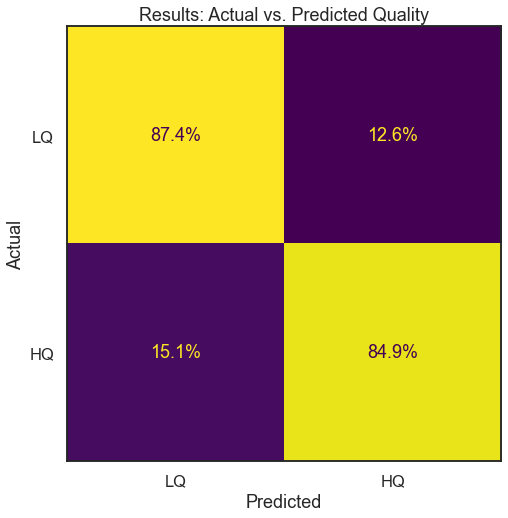
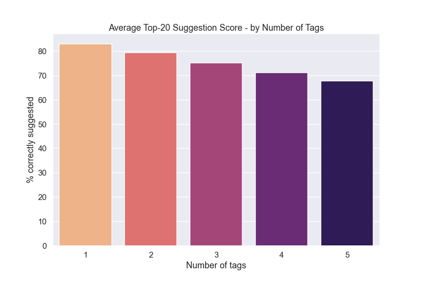

# Stack Overflow - Question Modeling for Quality-of-Life

**Authors**: Will Dougherty

## Overview

With millions of questions and answers, Stack Overflow is a uniquely positioned resource for the coding community. Though often criticized and complained about, it's an invaluable tool to find answers and discussion about very specific coding problems very quickly.]

In this project, I used Natural Language Processing (NLP) to predict both quality and the tags for Stack Overflow questions, to provide the foundation for implementing features that could be used in the moment of posting - that is, a user could be alerted if their post is likely to be low-quality, and tags could be suggested based on the text of the question. In both cases, the models do a good job of accomplishing their objectives, and the analysis that led to them informs their best usage and implementation.

### Business Problem

Stack Overflow also occupies a unique position in that it is in the form of a Q&A platform, but is often used as a wiki, or general knowledge base. With aggressive post moderation (i.e. removal of duplicate/already-answered questions) and an upvote system, the focus of the site is on both quality, and ease of search.

Thus the two main components of this project are:
- Question quality
- Tagging

Anything that can be done in the moment of posting a question, before it's 'out in the wild', will help take the pressure off of the moderation team and all of the behind-the-scenes tools that are used to help weed out bad posts, and to make sure that proper tags are assigned.

#### I. Quality

This component aims to predict, without an imbalance of false negatives and positives, whether a post is 'high' or 'low' quality - a binary classification. If a user's question is then compared against this model, they can be alerted if it is likely to be low quality, and given a chance to review the post guidelines and re-examine the question before posting it.

#### II. Tagging

This component aims to predict, and then suggest, a field of most-likely tags for a given question. Currently, the user is presented with an empty entry field; although it auto-completes as you type tag names, it isn't based on the text of the just-written question.

Because of the subjective nature of tagging, it would be best to suggest the top 20 or so tags that are most likely to apply to a given question's text. This allows the user to select the ones they feel are most applicable, and even if all of the 'true' tags aren't present, the model is accurate enough that it will likely help the user remember/be reminded of tags that they may not have otherwise thought of.

***
## Question Quality

### Data

There are several datasets of Stack Overflow post data, and for this component I am using two different datasets:

- 60k Stack Overflow Questions with Quality Rating
https://www.kaggle.com/datasets/imoore/60k-stack-overflow-questions-with-quality-rate

This is used to build the model, as it contains ground-truth quality ratings. It is limited to only posts with the 'python' tag.

- Python Questions from Stack Overflow
https://www.kaggle.com/datasets/stackoverflow/pythonquestions

This is much larger, and is used to see how the smaller dataset's model compares against a larger dataset. This is not used to build the model because there is no concrete 'quality' rating, and only things like 'Score' and 'answer_count' are available.

However, as we'll see, the smaller model does seem to have correllation with those aspects of the larger dataset, which suggests further work is warranted.

### Methodology and Goals

In order to predict quality, the text must be cleaned and vectorized, and class imbalance addressed.

For modelling, Logistic Regression is relatively cheap (in system resources and training time) and well-suited to this relatively straightforward modelling problem.

With only the binary classification to deal with, a confusion matrix will be the best way to see the results. A balanced pair of True Positive/False Positive accuracy scores will be used to validate the model.


Based on EDA, I was able to find an optimal (or at least high-performing) method of cleaning the text data:

- combine title and body text
- remove HTML tags
- remove code
- remove stopwords
- stemming
- other misc. cleanup (whitespace, etc)

This can be seen in the first few columns above.

***
In order to test the model, I'll split it into train and test portions.

I'll simply select the first 80% and the last 20%, since a real-world application would always be using a model built on past posts that are then tested on future posts.

In addition, class imbalance is an issue. Using the RandomOverSampler, we can generate more of the '1' (high-quality) samples, so as to help the model train properly.

Finally, fitting the LogisticRegression model with tuned hyperparameters allows us to see plot how well it does at predicting the two classes.



#### Evaluation

So we see a strong result here. With 89% of the 'low quality' label, and 90% of the 'high quality' label correctly predicted, we don't have a skew either way that would disproportionately affect either target class. False positives would allow low-quality posts to slip through, and false negatives would annoy users who are writing a high-quality question.

##### Vs. Baseline model

A baseline model would simply predict '0' for every class, and thus achieve an accuracy of 67% since 2/3 of the samples are in the '0' class. Thus, the model does a good job of not only improving on accuracy, but actually distinguishing the two classes, and balancing it almost perfectly.

***

To add on to this, because of the lackluster results of directly modelling the larger Python Q&A dataset, I'll take a look at how well this smaller model can do in labelling the larger dataset's samples, and how that lines up with the 'Score' and 'answer_count' features, since those are the closest proxy for 'quality' in that dataset.

I will use the entire 60k dataset as the training data, and test it on 100,000 samples of the larger Python dataset.


There is a clear correlation between Score and the predicted quality target.

The nature of the datasets is likely somewhat different, since the 60k dataset probably has posts that were removed because of low quality, and the Python Q&A dataset likely only has posts that are still up.

However, this is encouraging to see such a clear gradient from left to right, which suggests that with more data on post quality from Stack Overflow, a very high-performing model could be built to predict quality and alert users.

***
***
## Tag Prediction and Suggestion

### Data

For this component, I will use this large dataset:

- StackSample: 10% of Stack Overflow Q&A
https://www.kaggle.com/datasets/stackoverflow/stacksample?datasetId=265&sortBy=commentCount&select=Questions.csv

It is structured identically to the Python Q&A dataset, but includes posts with all tags. Limiting it to the 'Python' tagged posts creates issues with how it's modelled and validated.

### Methodology and Goals

The goal is a model that can provide suggested tags to a user, before they post their question. Users are given an entry field to enter tags, but it only auto-completes when you start typing. This can enable better and faster tagging for users, and facilitate better searching and generation of 'related post'-type features on the site.

The model itself is predicting tags for each post, but to generate a top-20 list of suggested tags, the model needs to provide probabilities the for all tags for that post.

So ultimately, to achieve this, a Multi-Label Classification model is needed. This is in fact a collection of models, one for each label class (tag), that generates probabilites for each tag for each post. It becomes easy to imagine that this can quickly get out of hand, both in memory usage and training time.

***

To that end, a balance has to be struck regarding number of samples and number of tags to include in the model; below, we'll see the quarterly post counts to give a sense for how many posts are created over time.


## Data Preparation

Because of its similarity to the Python dataset, the same preparation steps will be undertaken for this dataset.

The only difference is in including the tags, which are simply joined into a list for each post.

## Data Modeling

As said before, a balance has to be found regarding the number of samples to build the model with, and how many tags to use - the latter will determine how many individual classifiers will need to be trained.

***
### Number of Samples

The dataset has 1,264,216 posts, with many more answers, and tags for each post.

Since it would be prohibitive to build a model with every sample unless it was obviously much more accurate, I investigated whether the tag usage changes drastically over time, which would suggest that smaller models built using a subset of the data that is more similar to the data to be predicted would yield better results.


Among the top-256 tags, these show that the fastest-growing and -shrinking tags are definitely fluctuating drastically in proportion to the field of tags in the entire dataset.

Let's also look at how much the ranking of top tags changes over time.

RBO (Rank Biased Overlap) is a measure of similarity between two ranked lists, and is appropriate here because of the nature of the top-tags rankings over time. This measure accounts for position as well as whether tags exist in both lists. Below, we'll see the measure of each quarter's RBO when its top rankings are compared with the previous quarter's.

RBO is interpreted as a measure of similarity, with 1.0 being exactly the same, and 0.0 as completely different lists.

RBO resources:

https://github.com/ragrawal/measures/blob/master/measures/rankedlist/RBO.py

https://ragrawal.wordpress.com/2013/01/18/comparing-ranked-list/

http://codalism.com/research/papers/wmz10_tois.pdf


As we can see, the amount of RBO similarity stabilizes around .55 - .65, so there is (colloquially) a quarter-to-quarter churn of about 35-45% in terms of the top-tag rankings.

***

Thus, it would make sense to only use data that is relatively recent to the data that you want to predict tags for.

In the EDA and prep/modeling notebooks, more exhaustive exploration of this is undertaken. Ultimately, a subset of 200,000 samples seems to make the most sense here, as that accounts for roughly the last year or so of data, and is a nice balance between being hyper-focused on a period of time, and building a large, robust model.

***

### Number of Tags

The tags of the dataset are unevenly distributed among the posts. A small number account for the vast majority of used tags, and a very large number of tags are used very rarely, or even just once.

Below is a representation of how many posts have at least one of the top-n tags:


Thus, I decided to settle on 2,000 top tags, which accounts for around 97% of posts having at least one of the tags. This allowed for a model that could be built and trained with a feasible amount of memory and training time, and achieved good results.

### Model selection

There are several options available for multi-label classification, but the most often-used are:

- One-vs-Rest
    - A collection of individual models for each tag (in this case, a SGD-Logistic Regression model)
- Classifier Chain
    - Similar to a decision tree, it filters posts through various classifiers to arrive at a collection of predicted tags

After experimenting with these options, the One-vs-Rest classifier made the most sense to use in this project. Using SGD-Logistic Regression allows for the individual models to train relatively quickly, and model has the ability to predict probabilities for each tag for each post, allowing for a ranked list to be created that can populate a predicted top-20 ranking for each post.

### Metrics

Since measures like accuracy, f1, etc become cumbersome when dealing with a vast number of target classes, there are two main metrics I used to determine the performance of the model.

#### Hamming loss
    - A calculation of similarity between two lists. This ranges from 0-1 (0 being best), and in this case, the values tend to be very small due to the large number of possible tags.
#### Top-20 Prediction metrics
    - This is my own method of determining how well the model does across all of the predictions. For each post, using the predicted probabilities, I can then calculate the following based on whether each post's actual set of tags are in the predicted list. The goal is to have all of the 'true' tags in the suggested tag list.
    - The two main measures are:
        - % of tags that exist in their post's predicted top-20
        - Average score of posts' tag set that are in the predicted top-20




## Conclusions

Provide your conclusions about the work you've done, including any limitations or next steps.

***
Questions to consider:
* What would you recommend the business do as a result of this work?
* What are some reasons why your analysis might not fully solve the business problem?
* What else could you do in the future to improve this project?
***

## For More Information

Please review our full analysis in the EDA and prep/modelling notebooks in the ./code folder.

## Repository Structure

```
├── __init__.py                         <- .py file that signals to python these folders contain packages
├── README.md                           <- The top-level README for reviewers of this project
├── phase5-project.ipynb                <- Narrative documentation of analysis in Jupyter notebook
├── presentation.pdf                    <- PDF version of project presentation
├── code
│   ├── __init__.py                     <- .py file that signals to python these folders contain packages
│   ├── visualizations.py               <- .py script to create finalized versions of visuals for project
│   ├── data_preparation.py             <- .py script used to pre-process and clean data
│   ├── eda_notebook.ipynb              <- Notebook containing data exploration
│   └── prep_modelling_notebook.ipynb   <- Notebook containing data exploration
├── data                                <- Both sourced externally and generated from code
└── images                              <- Both sourced externally and generated from code
```

## Data sourcing

To replicate this repository's results, simply unzip the data from the resources linked above into the respective folders inside ./data.